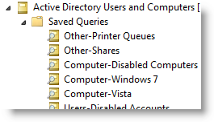
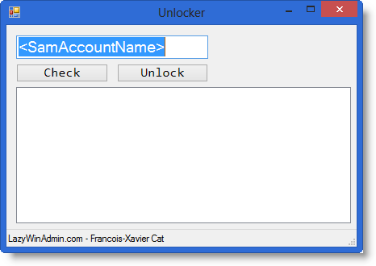
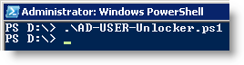

Occasionally an Active Directory account may be automatically locked if the domain's security policy has been configured to lock accounts after a number of unsuccessful logon attempts.

When this happens, the AD account the [lockouttime](http://msdn.microsoft.com/en-ca/library/windows/desktop/ms676843(v=vs.85).aspx) attribute will contain a `Win32 time` value that indicates when the account was locked.

An easy way to search for locked out accounts is an LDAP query similar to `((objectClass=user)(lockoutTime=>0))`

You can integrate this query in the saved queries of your Active Directory Users and Computers MMC.

### Description

The following script will use PowerShell to generate a WinForm and give you the ability to unlock account right from the interface. The goal is to do something simple and functional, nothing fancy.

The GUI was created using PowerShell Studio from SAPIEN. You can try this tool by going on Sapien.com

### No Module Required

The beautiful part of it is that no Active Directory Module or Quest Active Directory Snapin are required
In my case I used <b>ADSI</b>: <b>[ADSISearcher]</b>

If you want to know more about `ADSISearcher` check this [article from the Scripting Guy](http://blogs.technet.com/b/heyscriptingguy/archive/2010/08/24/use-the-powershell-adsisearcher-type-accelerator-to-search-active-directory.aspx)

### User Interface

Here is what the tool look like:

### Usage

Invoking the script from a PowerShell will do it. Make sure you run this with an account that have the privileges to unlock accounts.

### Download

Script available [on Github](https://github.com/lazywinadmin/PowerShellGUI/tree/master/AD-User-Unlocker)