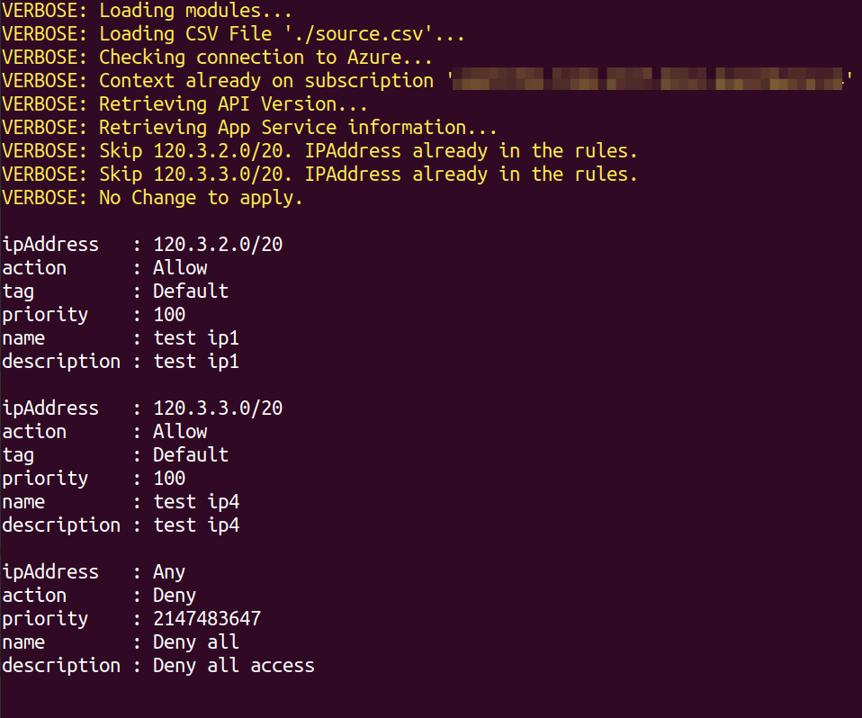


**Tested on** PowerShell 7.0.0 on Ubuntu 18.04

{{mynote}}{: .notice--info}

I recently helped out a friend who needed to configure restrictive IP Address Rules on an Azure App Service Service using PowerShell. The goal was to be able to set IP Address Rules but also overwrite anything currently setup.

Azure App Services are publicly accessible by default via `your_app_name.azurewebsites.net` or `your_app_name.scm.azurewebsites.net`. You might want to restrict the access to specific IP CIDR or force clients to access your app via different routes, examples: Application Gateway or Firewall.

In the Azure Portal, the IP Address Rules can be set under the **Networking**/**Access Restrictions** properties of the App Service.


I would usually recommend using something like Terraform for these types of scenarios where you want to track the state of your resources. However for this particular example we wanted to perform the task using a PowerShell script.

We came up with the following approach where we used a CSV file as a source of truth and let PowerShell do the rest by appending/or/overwriting the IP Address Rules specified in the file.

Here is an example of content for the CSV File:

```text
"ipAddress","action","priority","name","description","tag"
"120.3.2.0/20","Allow","100","test ip1","test ip1","Default"
"120.3.3.0/20","Allow","100","test ip4","test ip4","Default"
```

# Usage

If you look at the Comment-based help of the script, there are a few mandatory parameters: `-ResourceGroupName`, `-AppServiceName`, `Subscription` which help defined the scope/target of the change. `Path` to provide the CSV file which contain the IP Address Rules.

`Overwrite` specifies that you want to erase all the existing rules. When not specified, the script assume you just want to append new rules. It will also check if the IP/CIDR is already present before appending, if already present it will skip the rule.

```powershell
# Append ip rules not already present.
# The script only checks if the IP/CIDR is present,
#  it does not check the other properties
$Splatting=@{
    ResourceGroupName = "MyRG"
    AppServiceName = "MyApp"
    SubscriptionId = '<GUID>'
    Path = ./source.csv
    verbose = $true
}
AppService-Update_RestrictionIP.ps1 @Splatting

# Erase all existing rules and append
#  the ones specified in the CSV file
$Splatting=@{
    ResourceGroupName = "MyRG"
    AppServiceName = "MyApp"
    SubscriptionId = '<GUID>'
    Path = ./source.csv
    verbose = $true
    overwrite = $true
}
AppService-Update_RestrictionIP.ps1 @Splatting
```

Script in action:




## Download

[Script available on Github](https://github.com/lazywinadmin/PowerShell/tree/master/AZURE-AppService-Update_RestrictionIP).


## Resources

* [Microsoft Docs - Azure App Service access restrictions](https://docs.microsoft.com/en-us/azure/app-service/app-service-ip-restrictions)
* [Microsoft Docs - Azure Web Application Firewall on Azure Application Gateway](https://docs.microsoft.com/en-us/azure/web-application-firewall/ag/ag-overview)
