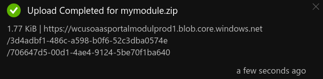
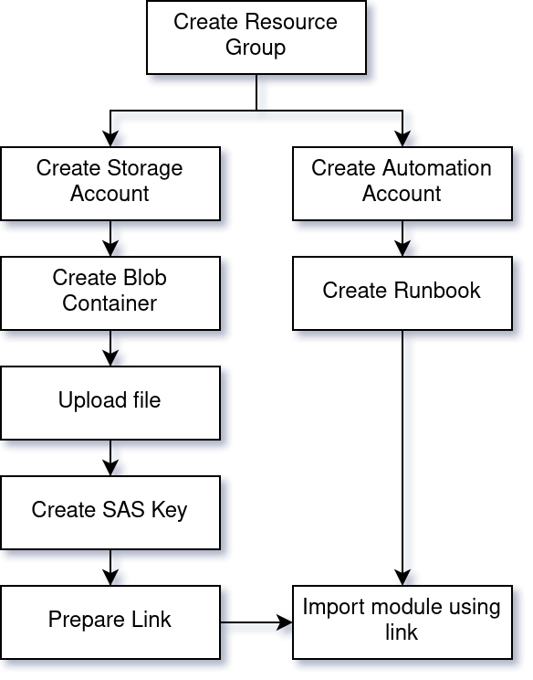
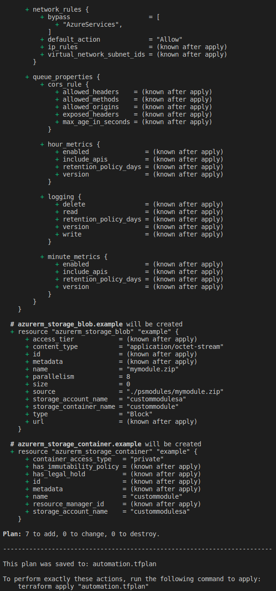
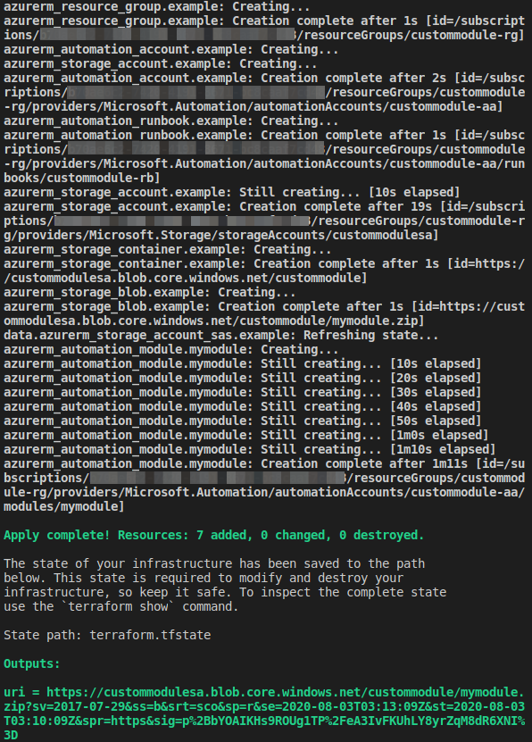


**Test environment** Ubuntu 20.04, Terraform v0.12.28, provider.azurerm v2.18.0

{{mynote}}{: .notice--info}


Azure Automation runbooks are a convinient way to run code in the cloud or on-premises (using Hybrid workers). You create a runbook, create a webhook and your code can be pretty much triggered by any event or system.

I had a scenario where some of my runbooks were using a custom PowerShell module that was not publicly available.

This short article document my approach.

While developping some terraform configuration I noticed the `azurerm` provider did not offer a way to upload a PowerShell module into the Automation account. You can only provide a `Uri` of a module location,... meaning they expect you make it available somewhere to be picked up. This applies to other tool offerings (ARM, API, ...).

However, if you use the Azure Portal, you have the option to upload your module as a zip file. Looks like Microsoft provide a Storage Account in the back end, generate a link and pass it other to Azure Automation to import the file.

This is what you would see in the portal after submitting your file:



## Uploading a PSModule to a Storage Account with Terraform

I used Terraform to replicate the Azure Portal functionnality in the following scenario:

1. Create a Storage Account
2. Create a Blob container
3. Upload the file
4. Create a SAS key (valid for 180 seconds in my case)
5. Provide the link to Azure Automation Account to import the module.

Here is whole workflow, including the dependencies.




## azurerm_automation_module Terraform resource

As you can see [in the hashicorp documentation](https://www.terraform.io/docs/providers/azurerm/r/automation_module.html), the terraform resource `azurerm_automation_module` only provide a `uri` parameter for module to import.

```
resource "azurerm_automation_module" "mymodule" {
  name                    = "mymodule"
  resource_group_name     = azurerm_resource_group.example.name
  automation_account_name = azurerm_automation_account.example.name

  module_link {
    uri = "https://somewhere/mymodule.1.0.0.zip"
  }
}
```

## Code

*Show me the code already! Jump to [download](#download)*

In the following I'm using Terraform and the azurerm provider to create the resources needed. Nothing very complicated but a few requirements to be aware of.

### Requirements
#### Authentication

For the authentication to Azure I'm using a Service Principal Name (SPN) which has the appropriate permissions to go and do things on my Subscription.

As an example, you can create an SPN and grant it "Contributor" permissions using the following Az Cli commands:

```bash
az ad sp create-for-rbac --role="Contributor" --scopes="/subscriptions/<subID>"
```

The output will look like this

```text
{
  "appId": "<Secret Stuff>",         # client_id
  "displayName": "azure-cli-2019-05-26-21-21-54",
  "name": "http://azure-cli-2019-05-26-21-21-54",
  "password": "<Secret Stuff>",      # client_secret
  "tenant": "<Secret Stuff>"         # tenant_id
}
```

#### Create the secrets.tfvars.json file

From the previous output, I'm creating a file called `secrets.tfvars.json`.
This file will be passed to Terraform at runtime.

```
{
  "appId": "<spn app id>",
  "password": "<spn password>",
  "tenant": "<tenant id>",
  "subscription_id": "<sub id>"
}
```

If you intend to run terraform in a CI/CD system, you might choose to store these values in a Vault, pull them at runtime and [set environment variables recognized by Terraform](https://www.terraform.io/docs/providers/azurerm/index.html#authenticating-to-azure).

### Usage

Once the requirements described above are in place, we can proceed with the following commands:

```bash
# Navigate to directory containing the configurations

# Initial configuration/get dependencies
terraform init

# Plan and Apply our changes
terraform plan -var-file "secrets.tfvars.json" -out automation.tfplan
terraform apply "automation.tfplan"

# Destroying the resources
terraform plan -var-file "secrets.tfvars.json" -out automation.tfplan -destroy
terraform apply "automation.tfplan"
```

#### terraform plan



#### terraform apply




## Download

The code is available [on Github](https://github.com/lazywinadmin/terraform/tree/master/azure/automationaccount/upload_psmodule) on my `terraform` repository.

## Resources

- [Terraform -  Authenticating to Azure](https://www.terraform.io/docs/providers/azurerm/index.html#authenticating-to-azure)
- [Terraform -  azurerm_automation_module resource](https://www.terraform.io/docs/providers/azurerm/r/automation_module.html)
- [Microsoft - Management API - Automation/Module](https://docs.microsoft.com/en-us/rest/api/automation/module/createorupdate#contentlink)
